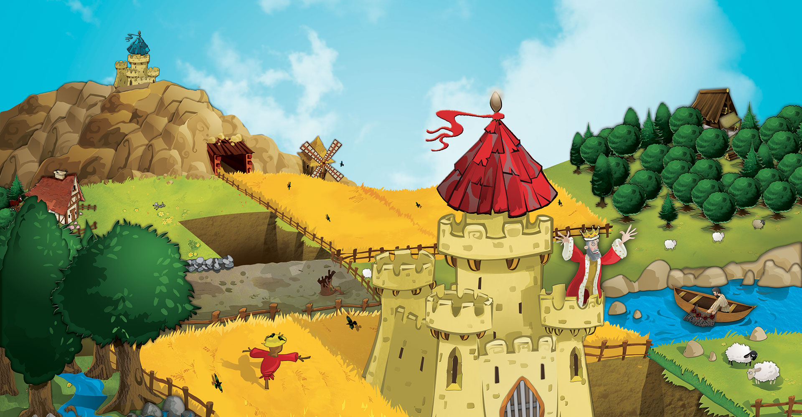

# Projet A31 - Mode emploi



# Sommaire
1. ### Introduction
2. ### Procédure d'installation du projet en local
3. ### Procédure d'installation de l'exécutable
4. ### L'exécutable
5. ### Membres de l'équipe

_____

## 1. Introduction 
### Projet
L'objectif de ce projet est de concevoir une application permettant de jouer au jeu de société Kingdomino.

- Ce projet à était réalisé à l'aide du langage [`Java`](https://www.java.com/fr/download/manual.jsp/)
- JDK utilisé : [`Azul Zulu OpenJDK v16`](https://www.azul.com/downloads/).

### Nos rapports
-  [Rapport V1](../rendu1/rapportV1.md)
-  [Rapport V2](rapportV2.md)

## 2. Procédure d'installation du projet en local

- **Clonage du projet en local** : Pour installer notre projet, **cloner** notre dépôt, et dans un répertoire vide, taper la commande suivante : 
 
    ```git clone https://git.unistra.fr/vondermarck-yanovskyy/a31-kingdomino.git```

### Possibles problèmes rencontrés 

#### Problème d'exécution 
> Si vous voulez exécuter le code présent dans le répertoire ``rendu1`` veuillez ouvrir ce répertoire directement avec IntelJ. Sinon cette erreur peut apparaitre.

```
Erreur : impossible de trouver ou de charger la classe principale launcher.LauncherKingdominoRendu1
Causé par : java.lang.ClassNotFoundException: launcher.LauncherKingdominoRendu1
```

#### Problème d'affichage de l'interface graphique
> Si en voulant tester le Swing sur un ordinateur Linux, l'affichage graphique ne s'affiche pas bien, il suffit d'aller dans la classe `Window` et d'aller à la ligne 33 et enlever la ligne `frame.setLocationRelativeTo(null);` (cela permet d'avoir la fenêtre d'affichée au mileu de l'écran de l'ordinateur)

## 3. Procédure d'installation de l'exécutable

| Windows  | Linux & Mac OS |
|:-:|:-:|
| Télécharger le jeu <a href="https://git.unistra.fr/vondermarck-yanovskyy/a31-kingdomino/-/blob/master/rendu2/a31-kingdomino_V2.jar?inline=false">ici</a>, exécuter, et voilà ! | Télécharger le .jar <a href="https://git.unistra.fr/vondermarck-yanovskyy/a31-kingdomino/-/blob/master/rendu2/a31-kingdomino_V2.jar?inline=false">ici</a>, ouvrer un terminal et diriger vous vers le dossier ou vous avez sauvegarder l'exécutable, puis taper : <br />  `$ java -jar a31-kingdomino_V2.jar.jar` |

> Si vous avez un souci lors de l'éxécution du fichier `.jar`, nous vous invitons à suivre les instructions pour mettre à jour Java  [ici.](https://www.java.com/fr/download/)
> Et de faire en sorte d'avoir installé [`Azul Zulu OpenJDK`(https://www.azul.com/downloads/) (version supérieure à 16).

## 4. L'exécutable
### Écran d'accueil
1. Premièrement, quand nous lançons l'exécutable, nous sommes amenés sur une petite fenêtre, permettant de choisir le mode de jeu (qui n'est pas obligatoire) et de sélectionner le nombre de joueurs. Une fois que l'utilisateur clique sur le bouton Start, il sera amené sur une nouvelle fenêtre, qui lui permettra de joueur au jeu.
   

### Écran en partie
2. Après avoir choisi le mode de jeu et le nombre de joueurs (ici 4), cette fenêtre de jeu permet d'assurer la totalité d'une partie.
   

- Tout d'abord, chacun des joueurs doit placer leur château sur leur royaume. Par ailleurs, chacun des joueurs peut modifier leur nom de joueur en cliquant, tout simplement, sur leur nom.
  

- Ensuite, avant de pouvoir choisir leur domino, la personne doit montrer les dominos.
  
- Chacun des joueurs doit choisir leur domino, tout en ne prenant pas le même qu'un autre joueur.
  
- Quand un joueur clique pour sélectionner son domino, un petit carré s'affiche avec la couleur du Roi (Dans une prochaine version, au lieu d'afficher simplement une couleur, nous implémenterons une image avec le Roi du joueur en question dans chacun des petits carrés).

### Fin de partie


### Vidéo
Voici une vidéo ou une partie est joué. (vidéo youtube)
[](https://www.youtube.com/watch?v=DUabSjffzgM)


### Explication de nos boutons de placement du domino
- Tout d'abord, quand on laisse la souris quelque seconde sur un des 4 boutons il y a un petit texte d'information.

#### Les boutons de rotations 
-  : ce bouton a pour but de mettre le domino soit dans le sens vertical ou dans le sens horizontal.
-  : ce bouton a pour d'inverser le domino. La tuile de gauche sera positionnée à droite, et inversement.

#### La mise en place du domino
- Si le bouton est dans le sens horizontal, il y aura un bouton avec une lettre "L" (Left = gauche) et "R" (droite).
- Si le bouton est dans le sens vertical, il y aura un bouton avec une lettre "U" (Up = en haut) et "D" (en bas).

> Ces 2 boutons en fonction de l'orientation verticale ou horizontale du domino a pour but de placer le domino dans le sens où souhaite le joueur.
> En effet, la tuile qui se trouvera tout en haut à gauche (sur l'écran de gauche, au-dessus des 4 boutons), sera la tuile posée là où le joueur va cliquer sur son royaume.
> En choisissant s'il veut son autre tuile à gauche, à droite, en haut ou en bas, l'entièreté de son domino sera placée dans son royaume.

##### Exemple 
 
- Le joueur clique sur la flèche violette. On voit que la tuile jaune, qui se trouve tout en haut à gauche de l'écran de prévisualisation se retrouve là où le joueur clique.
- Le jouer a sélectionné le bouton "L" (gauche), donc l'autre tuile du domino, qui se retrouve à l'horizontale (la tuile verte), va se retrouver à gauche de la tuile jaune.

## 5. Membres de l'équipe
- Julien Von Der Marck
- Alexander Yanovskyy